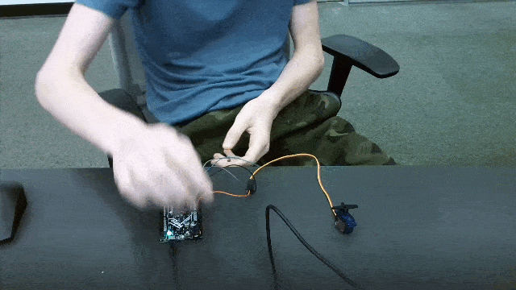
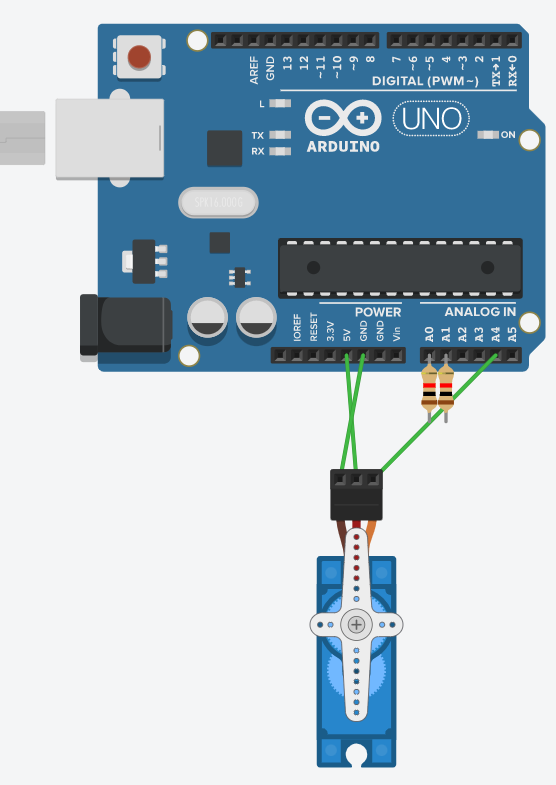
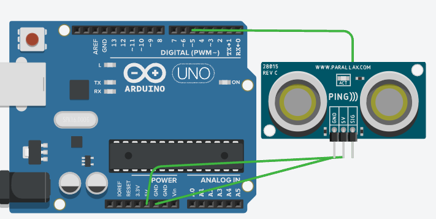
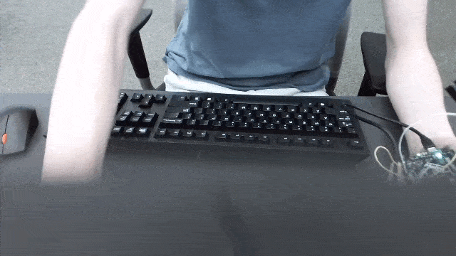
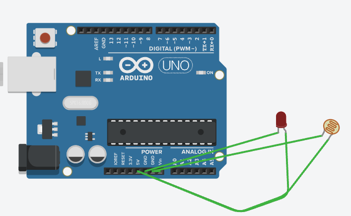

# CircuitPython
## Table of Contents
* [Table of Contents](#TableOfContents)
* [Hello_CircuitPython](#Hello_CircuitPython)
* [CircuitPython_Servo](#CircuitPython_Servo)
* [CircuitPython_LCD](#CircuitPython_LCD)
* [NextAssignmentGoesHere](#NextAssignment)
---

## Hello_CircuitPython

### Description & Code

This code makes a LED slowly increase in color and slowly becomes more green.

```python
import board
import neopixel
import time

dot = neopixel.NeoPixel(board.NEOPIXEL, 1)


dot.brightness = 0.1

r = 0
g = 0
b = 0
while True:

    if b < 240:
        b += 4
    if b == 240:
        g += 4
        b = 0
    if g == 240:
        r += 4
        g = 0
        b = 0
    
    dot.fill((r, g, b))
    time.sleep(0.01)
    print(r, g, b)
```


### Evidence
Pictures / Gifs of your work should go here.  You need to communicate what your thing does.

### Wiring
The only requirement is a board.
### Reflection
The largest difficulty was learning python syntax and how to make it work correctly. I had to makke sure it was a += and a -= until I made it choose randomly


## CircuitPython_LCD

### Description & Code
this code makes the lcd display a counter which counts and changes with capacitive touch.
```python
import board
from lcd.lcd import LCD
from lcd.i2c_pcf8574_interface import I2CPCF8574Interface
import time
import touchio

# get and i2c object
i2c = board.I2C()
touch_A1 = touchio.TouchIn(board.A1)  
touch_A2 = touchio.TouchIn(board.A0)  
c = 0
d = 1
b = 0
s = 0
# some LCDs are 0x3f... some are 0x27.
lcd = LCD(I2CPCF8574Interface(i2c, 0x3f), num_rows=2, num_cols=16)
while True:
    lcd.clear()
    if touch_A2.value and b == 0:
        if d == 1:
            c+=1
        if d == 0:
            c-=1
        b = 1
    if touch_A1.value and s == 0:
        if d == 0:
            d = 1
        elif d == 1:
            d = 0
        s = 1
    if not touch_A2.value:
        b = 0
    if not touch_A1.value:
        s = 0
    lcd.print(str(c))
    if d == 0:
        lcd.print(" down")
    if d == 1:
        lcd.print(" up")
    time.sleep(.1)
```
### Evidence

### Wiring

### Reflection
this project was very simple I just had to wire up an LCD and then make sure it only went once per wire touch. you should always remember to clear your LCD in between repetitions.
## CircuitPython_Servo

### Description & Code
this code uses capacitive touch to make the servo rotate
```python
import time
import board
import touchio
import servo
import pwmio
pwm = pwmio.PWMOut(board.A4, duty_cycle=2 ** 15, frequency=50)
my_servo = servo.Servo(pwm)
touch_A1 = touchio.TouchIn(board.A1)  
touch_A2 = touchio.TouchIn(board.A0)  
A = 1
while True:
    if touch_A2.value and A < 180:
        A += 1
        print("hi")
    if touch_A1.value and A > 0:
        A -= 1
        print("there")
    my_servo.angle = A
    time.sleep(0.005)
```

### Evidence

### Wiring



### Reflection

Limits are a very good idea when you have a shifting number. forgetting them cost me a decent bit of time and was also stressful.


## CircuitPython_sensor

### Description & Code
this code makes a LED change color based on the distance to an object
```python

import time
import board
import adafruit_hcsr04
import neopixel

dot = neopixel.NeoPixel(board.NEOPIXEL, 1)
dot.brightness = 0.1
sonar = adafruit_hcsr04.HCSR04(trigger_pin=board.D5, echo_pin=board.D6)
r = 0
g = 0
b = 0

while True:
    try:
        print(sonar.distance)
        if sonar.distance <= 15:
            r =  abs(round(sonar.distance-5 / 15*255))
        if sonar.distance >= 10 and sonar.distance <= 30:
            b = abs(round(sonar.distance-5 / 15*255))
        if sonar.distance >= 25:
            g = abs(round(sonar.distance-5 / 15*255))
        if sonar.distance > 25:
            r = 0
        if sonar.distance < 10 or sonar.distance > 30:
            b = 0
        if sonar.distance < 30:
            g = 0
        print(r, g, b)
    except RuntimeError:
        g = 255
        print("retrying")
    dot.fill((r, g, b))
    time.sleep(0.3)
	


```

### Evidence

### Wiring

### Reflection
this one was very hard I had to make sure to round the number and take the absolute value to make sure the light did not bug out.


## photointerrupter

### Description & Code
this make the metro track the number of times that a photointerrupter has triggered.
```python
import board
import time
from digitalio import DigitalInOut, Direction, Pull

interrupter = DigitalInOut(board.D10)
interrupter.direction = Direction.INPUT
interrupter.pull = Pull.UP
start = time.time()
t = 0
c = 0
p = 0
second = 1
passed = 4
total = 0
scount = 0
counter = 0
while True:
    if time.monotonic() > total + passed:
        total += 4
        print("triggered:",counter,"times this rotation.")
        counter = 0
    elif interrupter.value == True and time.monotonic() > scount + second:
        counter += 1
        scount += 1


```

### Evidence

### Wiring

### Reflection
I learned how to use time monotonic and I also learned how much of a pain it can end up being. make sure that your new base is set to time monotonic.
